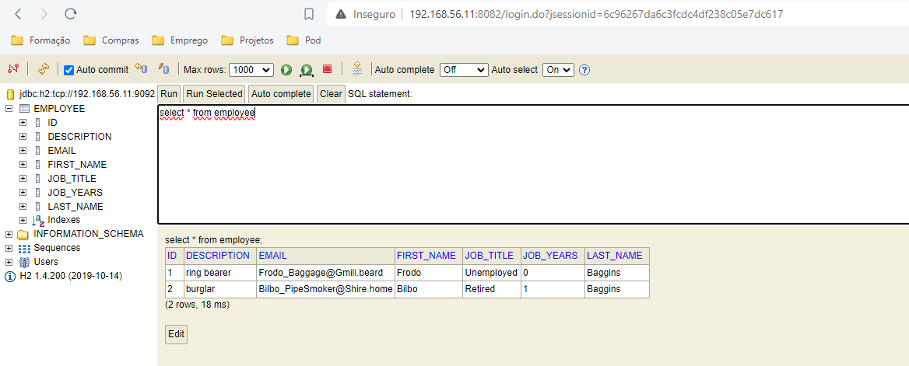

# Technical Report for CA3 Part 2: Virtual Environment Setup with Vagrant

## Introduction

Part 2 of Class Assignment 3 (CA3) focuses on utilizing Vagrant to set up a virtual environment for executing the Spring Boot tutorial application and the Gradle "basic" version developed in CA2, Part 2. The objective is to create a reproducible development environment using Vagrant, ensuring consistency across different systems and simplifying the setup process for students.

This report documents the steps required to achieve the goals outlined in the assignment prompt. It provides detailed instructions for configuring the Vagrantfile, updating dependencies, and integrating the Spring Boot application with the H2 server database running on a separate VM. Additionally, it outlines how to document the process in the readme file and mark the repository with the appropriate tag upon completion.

## Goals/Requirements

The main goals and requirements for Part 2 of CA3 are as follows:

1. **Vagrant Setup**: Utilize Vagrant to set up a virtual environment for running the Spring Boot tutorial application and the Gradle "basic" version developed in CA2, Part 2.
   - Since we're on windows we use the installer from the [Vagrant website](https://www.vagrantup.com/downloads).
   - After installing Vagrant we can open a terminal and check if it was installed correctly by running the command `vagrant --version`.
   - Vagrant uses Virtual Box as a provider by default, and we have this already installed from the previous assigment


2. **Initial Solution**: Utilize the provided initial solution from [https://bitbucket.org/pssmatos/vagrant-multi-spring-tut-demo/](https://bitbucket.org/pssmatos/vagrant-multi-spring-tut-demo/) as a starting point for setting up the virtual environment.


3. **Vagrantfile Study**: Analyze the Vagrantfile provided in the initial solution to understand how it creates and provisions two VMs: "web" for running Tomcat and the Spring Boot basic application, and "db" for executing the H2 server database.


4. **Copy and Update Vagrantfile**: Copy the Vagrantfile to your repository for this assignment and update its configuration to use your own Gradle version of the Spring application.


4. **Update Spring Application**: Modify the Spring application to use the H2 server in the "db" VM. Refer to [https://bitbucket.org/pssmatos/tut-basic-gradle](https://bitbucket.org/pssmatos/tut-basic-gradle) for the necessary changes and replicate them in your version of the Spring application.


5. **Documentation**: Describe the entire process, including Vagrant setup, Vagrantfile configuration, Gradle version update, and integration with the H2 server, in the readme file for this assignment.


6. **Tagging**: Mark your repository with the tag "ca3-part2" at the end of Part 2 of the assignment.


## Setup and Configuration

This section outlines the steps required to set up the virtual environment using Vagrant and fulfill the goals outlined in the assignment.

### Initial Setup

1. **Clone Initial Solution**:
    - Clone the initial solution repository provided at [https://bitbucket.org/pssmatos/vagrant-multi-spring-tut-demo/](https://bitbucket.org/pssmatos/vagrant-multi-spring-tut-demo/).
    - Navigate to the directory of the cloned repository.


2. **Study Vagrantfile**:
    - Examine the Vagrantfile included in the repository to understand its structure and how it defines the "web" and "db" VMs.


3. **Copy Vagrantfile**:
    - Copy the Vagrantfile from the cloned repository to the folder designated for this assignment in your own repository.

### Updating Vagrantfile

1. **Modify Vagrantfile**:
    - Open the copied Vagrantfile in a text editor.
    - Update the configuration to use your own Gradle version of the Spring application.
    - Modify the VM settings as necessary to match your system's resources and network configuration.
    - We open the following block to specify the commands we want to run inside our virtual machines. For example, to install openjdk 11 we can add the following block:
  ```ruby
  config.vm.provision "shell", inline: <<-SHELL
    sudo apt-get update
    sudo apt-get install openjdk-11-jdk
  SHELL
  ```
- To specify what Linux distribution we want to use:
  ```ruby
  config.vm.box = "ubuntu/bionic64"
  ```
- Both machines run ubuntu bionic 64 and install open jdk 17.
   - We can configure the IP's of the machines and the ports they run on. For the db machine we:
     ```ruby
     config.vm.network "private_network", ip: "192.168.56.11"
     db.vm.network "forwarded_port", guest: 8082, host: 8082
     db.vm.network "forwarded_port", guest: 9092, host: 9092
     ```

- The db machine additionally installs and H2 database that runs on port 9092 (Data) and 8082 (Console).
  ```ruby
  db.vm.provision "shell", inline: <<-SHELL
  wget https://repo1.maven.org/maven2/com/h2database/h2/1.4.200/h2-1.4.200.jar
  SHELL  
  ```
- We add our web vm block, that runs ubuntu bionic 64, with the IP and ports specified in the previous Vagrant file. This vm will have 1Gb of RAM:
  ```ruby
    #WEB VM ------------------------------------------------------
    config.vm.define "web" do |web|
      #SET MACHINE UBUNTU VERSION, NAME AND IP
      web.vm.box = "ubuntu/bionic64"
      web.vm.hostname = "web"
      web.vm.network "private_network", ip: "192.168.56.10"

      #SET RAM AMOUNT FOR VM TO 1GB
      web.vm.provider "virtualbox" do |v|
          v.memory = 1024
      end
  end
  ```
- To avoid wasting time, we tell Vagrant to stop the vm deployment in case it encounters an error by adding the command `set -e`.
- We want our web vm to run the application we created in [CA2 Part2](../../CA2/Part2) so we must add commands to clone our repository, navigate to it and execute gradle tasks, namely build and bootRun.
- We also want to copy the war file generated by the build task to the tomcat webapps folder and start tomcat.
- The final Vagrantfile portion for the web vm should look like this:
  ```ruby
   #WEB VM ------------------------------------------------------
   config.vm.define "web" do |web|
     web.vm.box = "ubuntu/bionic64"
     web.vm.hostname = "web"
     web.vm.network "private_network", ip: "192.168.56.10"

     #SET RAM AMOUNT FOR VM TO 1GB
     web.vm.provider "virtualbox" do |v|
         v.memory = 1024
     web.vm.network "forwarded_port", guest: 8080, host: 8080
     end
     web.vm.provision "shell", inline: <<-SHELL, privileged: true
      # USE SET -E COMMAND TO EXIT AUTOMATICALLY IF ANY SHELL COMMAND FAILS
      set -e
      # Install Node.js and npm
      curl -fsSL https://deb.nodesource.com/setup_16.x | sudo -E bash -
      sudo apt-get install -y nodejs


     #CLONE REPO AND CHANGE GRADLE WRAPPER PERMISSIONS AND EXECUTE BUILD
      git clone https://github.com/zepedrorodrigues/devops-23-24-JPE-PSM-1231837.git
      cd devops-23-24-JPE-PSM-1231837/CA2/Part2/demo
   # Remove any existing node_modules to ensure a clean install
      rm -rf node_modules

      # Install npm dependencies
      npm install

      chmod u+x gradlew
      ./gradlew build

      # Copy WAR file generated after Gradle build into Tomcat webapps
      sudo cp ./build/libs/*.war /opt/tomcat10/webapps

      # Startup Tomcat
      /opt/tomcat10/bin/startup.sh
    SHELL
  end
  end
  ```
   - Final solution: [Vagrantfile](Vagrantfile)
   - After making the changes to your `Spring Application` (next section) you can run the command `vagrant up` to start the deployment of our virtual machines. We can check the status of our machines by running `vagrant status` and we can SSH into them by running `vagrant ssh <machine_name>`. We can also stop the machines by running `vagrant halt` and destroy them by running `vagrant destroy`.
   

### Updating Spring Application

1. **Update Spring Application**:
    - Refer to [https://bitbucket.org/pssmatos/tut-basic-gradle](https://bitbucket.org/pssmatos/tut-basic-gradle) for the necessary changes to the Spring application to integrate it with the H2 server.
    - The VMs are setup but they need to be able to communicate with each other. We can do this by adding the following line to the application.properties file in the Spring application:
    ```properties
    #To enable the H2 database so our Web VM in CA3/Part2 can communicate with the database in the DB VM in CA3/Part1

    #The command at the end prevents the database from closing when the last connection is closed
    spring.datasource.url=jdbc:h2:tcp://192.168.56.11:9092/./jpadb;DB_CLOSE_DELAY=-1;DB_CLOSE_ON_EXIT=FALSE
    spring.datasource.driverClassName=org.h2.Driver
    spring.datasource.username=sa
    spring.datasource.password=
    spring.jpa.database-platform=org.hibernate.dialect.H2Dialect

    spring.jpa.hibernate.ddl-auto=update
    spring.h2.console.enabled=true
    spring.h2.console.path=/h2-console
    spring.h2.console.settings.web-allow-others=true
    ```
    - This will allow the web vm to communicate with the db vm. We can now run the application and see that it is able to communicate with the database in the db vm. Their communication port is 9092 and the database is called jpadb.
    - We define the password as empty and the username as sa. We also enable the h2 console and allow others to access it.
    - We also should edit the build.gradle file to include the H2 dependency:
   ```gradle
    plugins {
        id 'java'
        id 'org.springframework.boot' version '3.2.4'
        id 'io.spring.dependency-management' version '1.1.4'
        id 'org.siouan.frontend-jdk17' version '8.0.0'
        id 'war'
    }
   ```
   - We should also create a new class called `ServletInitializer` that extends `SpringBootServletInitializer` and overrides the `configure` method:
   ```java
    package com.example.reactandspringdatarest;

    import org.springframework.boot.builder.SpringApplicationBuilder;
    import org.springframework.boot.web.servlet.support.SpringBootServletInitializer;

    public class ServletInitializer extends SpringBootServletInitializer {

        @Override
        protected SpringApplicationBuilder configure(SpringApplicationBuilder application) {
            return application.sources(ReactAndSpringDataRestBasicApplication.class);
        }

    }
   ```
   - This will allow us to run the application as a war file in a tomcat server.
   - Also, as our app is a resource, we must tell our frontend where to get the data from by adding the following line to the `App.js` file:
   ```javascript
    componentDidMount() { // <2>
		client({method: 'GET', path: '/basic-0.0.1-SNAPSHOT/api/employees'}).done(response => {
			this.setState({employees: response.entity._embedded.employees});
           });
    }
    ```
   - After all these changes, we should push our code to our repository and run the `vagrant up` command to start the deployment of our virtual machines.
   - We can access the H2 console by going to `http://192.168.56.11:8082` and the data by going to `jdbc:h2:tcp://192.168.56.11:9092/./jpadb` with the username `sa` and no password.
   - We can access the application by going to `http://192.168.56.10:8080/react-and-spring-data-rest-basic-0.0.1-SNAPSHOT.war/`.
2. **Testing**:
    - Test the updated Spring application to ensure that it can successfully connect to the H2 database and perform operations as expected.
    - Visual outputs should look something like these:
    - 
    - 
    - 
### Documentation

1. **Readme File**:
    - Document the entire process in the readme file for this assignment.
    - Include detailed instructions for setting up the virtual environment with Vagrant, modifying the Vagrantfile, updating the Spring application, and integrating it with the H2 server.
    - Use Markdown syntax for clear and organized formatting.
    - Provide examples, code snippets, and screenshots where necessary to illustrate the steps.

### Tagging Repository

1. **Tagging for Part 2 Completion**:
    - Once all the steps are completed and documented, tag your repository with the tag "ca3-part2" to mark the completion of Part 2 of the assignment.
   ```
   git tag -a ca3-part2 -m "Complete CA3 Part 2"
   git push origin --tags
   ```
## Alternative Solution to VirtualBox: VMWare Workstation
1. When considering the setup of a virtual environment with Vagrant, one crucial decision is selecting the appropriate provider. While VirtualBox serves as the default provider for Vagrant and is widely used due to its open-source nature and ease of use, there are alternative options available, such as VMWare Workstation.
 - Why Choose VMWare Workstation?
   - Performance and Scalability: VMWare Workstation often offers better performance and scalability compared to VirtualBox. It is optimized for handling resource-intensive workloads and can efficiently manage large-scale virtual environments.


   - Enhanced Integration with VMWare Tools: VMWare Workstation provides seamless integration with VMWare tools and utilities, offering advanced features for virtual machine management, monitoring, and troubleshooting. This integration can streamline development workflows and enhance productivity.


   - Support for Virtualization Technologies: VMWare Workstation provides comprehensive support for virtualization technologies, including support for nested virtualization and advanced hardware virtualization features. This enables developers to leverage the full potential of virtualization in their development environments.


   - Commercial Support and Maintenance: As a commercial product, VMWare Workstation offers dedicated support and maintenance services, including regular updates, patches, and technical assistance. This level of support can be valuable for organizations requiring reliable and consistent virtualization solutions.


   - Considerations and Trade-offs:


     . Cost: VMWare Workstation is a commercial product and may involve licensing fees or subscription costs. Organizations should evaluate the cost-effectiveness of VMWare Workstation based on their budget constraints and requirements.
     . Compatibility: While VMWare Workstation offers extensive compatibility with various operating systems and virtual machine configurations, developers should ensure compatibility with their existing infrastructure and toolchain.
     . Personal Preference: Ultimately, the choice between VirtualBox and VMWare Workstation depends on personal preferences, organizational requirements, and specific use cases. Developers should assess the features, performance, and support options of each provider to determine the best fit for their needs.
2. How to change the Provider Configuration?
   - Specify the provider in the Vagrantfile:
    ```ruby
   Vagrant.configure("2") do |config|
   config.vm.provider "vmware_workstation" do |v|
   # VMware specific settings
   v.vmx["memsize"] = "1024" # Adjust memory size as needed
   v.vmx["numvcpus"] = "2"   # Adjust CPU cores as needed
   end
   end
    ```
3. Adjust Network Configuration:
   - Update the network configuration to use a private network:
    ```ruby
    config.vm.network "private_network", type: "dhcp"
     ```
4. Change Box Configuration:
   - Specify the box to use for VMware Workstation:
    ```ruby
    config.vm.box = "hashicorp/bionic64"
    ```
5. Comparison with VirtualBox:
   - VMWare Workstation offers additional features and performance improvements compared to VirtualBox.
   - It provides better integration with VMware tools and enhanced support for virtualization technologies.
   - VMWare Workstation is a commercial product, while VirtualBox is open-source and free to use.
   - The choice between the two depends on specific requirements, budget constraints, and personal preferences.
   
## Conclusion


In summary, the configuration of a virtual environment using Vagrant has been successfully achieved to execute the Spring Boot tutorial application and the Gradle "basic" version. Through meticulous adjustments to the Vagrantfile and integration of the Spring application with the H2 server database, a reproducible and consistent development environment has been established.

The documentation provided ensures clarity and accessibility throughout the setup process, serving as a valuable resource for developers. By adhering to proper version control practices, such as tagging the repository with "ca3-part2," project management and traceability are enhanced, facilitating collaboration and future reference.

Overall, the completion of Part 2 of CA3 demonstrates the ability to adapt and configure virtual environments efficiently, laying the groundwork for streamlined development workflows and empowering developers to innovate with confidence.